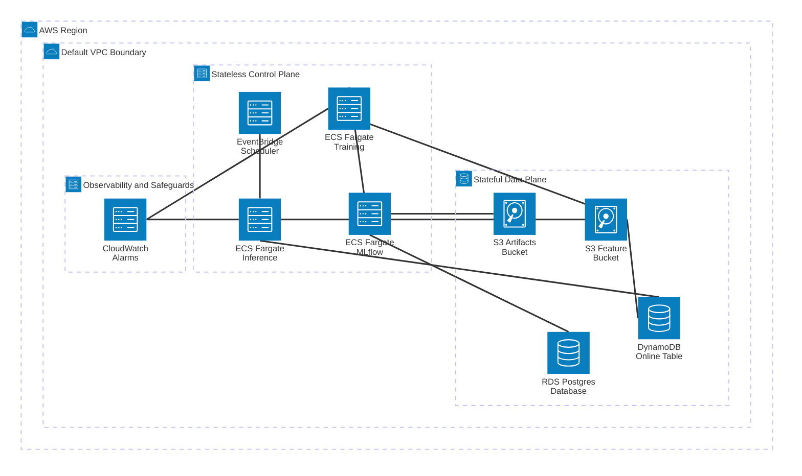

# Beyond the Notebook: The Operational Reality of an Enterprise ML Platform

Data scientists solve the last-mile problem. Engineers build the road. Most organizations get this wrong: they collapse all roles into one person, or silo them so hard the systems never talk and operations suffer. This post deconstructs the ML engineer's piece: built from scratch across 2 CDK stacks, 4 Fargate tasks, and 3 persistent stores. Total AWS spend to build and validate the platform: ~$1. The [full deployment log](https://github.com/danivpv/ml-platform/blob/41f9d85d0a882fbc37fa829c2935b76e140511c9/docs/ml-platform-prd.md#2-architectural-decision-log) documents every decision, every bug, and the exact cost breakdown.

---

## Maturing from Data Scientist to ML Engineer

A few years ago I was asked, at a previous job, to translate graph-based feature engineering into SQL for online serving. No feature store. No experiment tracking. No ability to reproduce the training environment. The task was technically possible. But without a system to keep offline and online feature logic synchronized, any result was structurally fragile: a time bomb with no visible fuse.

That experience crystallized something fundamental: the gap between a working notebook model and a reliable production ML service is not algorithms. It is operational infrastructure. Systems that make models reproducible, auditable, safely iterable, and cost-predictable. Most data scientists never see this layer directly because in mature setups it runs silently under the hood. When it is missing entirely, model operations become impossible to trust.

I wanted to build these systems from scratch. Not to compete with SageMaker, but to understand precisely what SageMaker is actually doing, how its boundaries operate, and how an engineering team designs systems to support operations and meet business demands.

---

## The Platform: 4 Subsystems, 1 Operational Goal

The platform is organized into a **stateful data plane** (S3, DynamoDB, RDS) and a **stateless control plane** (ECS Fargate, EventBridge, CloudWatch). Each subsystem is a self-contained AWS CDK component with its own `infrastructure.py` defining AWS resources and a `runtime/` folder containing the application code. All components are wired together in a single `component.py` file aligned with the [AWS Well-Architected Framework](https://aws.amazon.com/architecture/well-architected/).

| Subsystem | Operational Question Answered | Stack | Structural Guarantee |
| :--- | :--- | :--- | :--- |
| **Feature Store** | What exact historical features and timestamp produced this serving? | Feast, S3 (Parquet offline), DynamoDB (online) | Point-in-time joins eliminate training-serving skew at the storage layer. |
| **Experiment Lineage** | What exact model, parameters, and training data produced this prediction? | MLflow, RDS Postgres, S3 Artifacts | Atomic `@champion` alias promotion bridges production errors back to reproducible experiments. |
| **Decoupled Compute** | How do latency SLAs hold without wasting compute budget? | ECS Fargate, EventBridge Scheduler | Independent task definitions isolate bursty training memory from lean inference containers. |
| **IaC + Observability** | How do we iterate on compute without risking data loss? | AWS CDK Python, CloudWatch | `RemovalPolicy.RETAIN` and least-privilege IAM guarantee data plane survival across complete compute rebuilds. |

Explore the working implementation at [`commit 4c60434`](https://github.com/danivpv/ml-platform/tree/41f9d85d0a882fbc37fa829c2935b76e140511c9) and the [27-entry architectural decision log](https://github.com/danivpv/ml-platform/blob/41f9d85d0a882fbc37fa829c2935b76e140511c9/docs/ml-platform-prd.md#2-architectural-decision-log) for the full rationale behind every choice.

---

## Core Architectural Patterns

Four engineering decisions underpin the platform. Each one is labeled by the class of failure it eliminates structurally, because that is what separates a design decision from a library choice.

**Two-Stack CDK Deployment Boundary.** Eliminates **accidental data loss from compute iteration.** The infrastructure separates into two AWS CDK stacks by deployment boundary: stateful resources (S3, DynamoDB, RDS) carry `RemovalPolicy.RETAIN` and are never touched when compute changes; the stateless control plane (Fargate, EventBridge, CloudWatch) can be completely torn down and redeployed without risking the data plane. CDK cross-stack references pass typed Python construct objects rather than hardcoded ARNs, so all least-privilege IAM policies are resolved at synthesis time with zero runtime network calls. As a student I once left a SageMaker notebook instance running for a month because the underlying resources were hidden behind an opaque abstraction. A hard CDK deployment boundary makes that class of mistake structurally impossible. See [`app.py`](https://github.com/danivpv/ml-platform/blob/41f9d85d0a882fbc37fa829c2935b76e140511c9/app.py), the [AWS CDK Python project structure guide](https://aws.amazon.com/blogs/developer/recommended-aws-cdk-project-structure-for-python-applications/), and the [AWS CDK best practices guide](https://aws.amazon.com/blogs/devops/best-practices-for-developing-cloud-applications-with-aws-cdk/).

**Day-Zero Feature Store: Feast + Dual Store.** Eliminates **training-serving skew and label leakage.** `feast apply` is a schema migration: it writes a registry snapshot to S3. No data moves. `feast materialize` is the data sync: it reads offline Parquet files and writes the latest feature value per entity into DynamoDB. Most tutorials blur these two operations, which is how teams accidentally skip materialization and serve stale features in production. The dual-store pattern gives training a high-throughput S3 offline store for point-in-time joins (eliminating label leakage at the storage layer) and inference a sub-millisecond DynamoDB online store that costs $0 at idle vs Redis, which bills a node 24/7 regardless of traffic. See [`feature_repo/feature_views.py`](https://github.com/danivpv/ml-platform/blob/41f9d85d0a882fbc37fa829c2935b76e140511c9/feature_repo/feature_views.py) and [Feast documentation](https://docs.feast.dev/).

**MLflow `@champion` Alias as Production Pointer.** Eliminates **deployment coupling and experiment reproducibility loss.** MLflow is the source of truth for experiment lineage, artifact storage, and model promotion via named aliases. Reassigning `@champion` via `set_registered_model_alias` swaps the production model atomically, no container redeployment required. The `pyfunc` interface makes the inference container framework-agnostic: it does not know or care whether the champion is a random forest or a gradient booster. See the [MLflow Model Registry documentation](https://mlflow.org/docs/latest/model-registry.html) and [`train.py`](https://github.com/danivpv/ml-platform/blob/41f9d85d0a882fbc37fa829c2935b76e140511c9/src/ml_platform/training/train.py).

**Decoupled Compute: Training vs Inference.** Eliminates **resource waste and lifecycle coupling between workloads.** Sharing a container between training and inference is a common early shortcut that becomes a production liability. Training is computationally bursty: it needs high memory to process historical batches and build models. Inference runs on a strict EventBridge schedule and needs only enough memory to load weights and score records. Shared containers force both workloads onto the same resource profile, which either wastes budget or triggers out-of-memory crashes during training runs. Independent Fargate task definitions let each workload evolve its dependencies, resource limits, and container image independently. When a data scientist upgrades a training framework, the inference pipeline is untouched. See [`component.py`](https://github.com/danivpv/ml-platform/blob/41f9d85d0a882fbc37fa829c2935b76e140511c9/ml_platform/component.py).

---

## Two Pesky Bugs

The [full deployment log](https://github.com/danivpv/ml-platform/blob/41f9d85d0a882fbc37fa829c2935b76e140511c9/docs/ml-platform-prd.md#3-bug-and-resolution-log) documents 11 issues encountered during the v1 build. Two are worth calling out: both will cost hours if you hit them without knowing the root cause.

| Bug | Symptom | Root Cause | Fix |
| :--- | :--- | :--- | :--- |
| **Bug F: YAML Apostrophe** | `feast apply` failed with `Invalid bucket name "${feature_bucket}"` | An unmatched single quote in a YAML comment caused Python's `os.path.expandvars()` to treat everything following it as an open string literal, suppressing variable expansion. `${FEATURE_BUCKET}` was passed as literal text to boto3. | Remove all single quotes and contractions from YAML files and comments. |
| **Bug K: IGW Hairpinning** | Intra-VPC HTTP connections to the MLflow server timed out consistently | Containers connecting to MLflow via its public IP routed traffic out through the Internet Gateway. The return path stripped internal VPC security group metadata, causing AWS to drop packets even though the security group rule explicitly allowed ingress from the training task's security group ID. | Store the MLflow server's internal private IP in SSM Parameter Store and use it for all intra-VPC communication. |

---

## Conclusion

This platform answers 4 operational questions and costs ~$1 to validate. But it can only be operated by someone with AWS CLI access and enough architectural context to know which Fargate task to trigger. A data scientist who wants to test a new algorithm, register a model version, or inspect a prediction without touching CDK directly, cannot.

That is not a missing feature. It is a missing boundary.

Part 2 draws that boundary with a CQRS FastAPI layer. The moment a REST endpoint sits in front of the platform, two sides emerge: ML engineers who own the infrastructure, and data scientists who use it as clients through standard HTTP. That client-server split is what converts a personal workspace into a shared service. Parts 3 and 4 then deep-dive the training and inference subsystems individually, ironing each to production quality before the platform handles real use cases. Future posts cover the monitoring subsystem, applications, and the full Next.js dashboard that makes it accessible to business stakeholders.

The 27-entry [architectural decision log](https://github.com/danivpv/ml-platform/blob/41f9d85d0a882fbc37fa829c2935b76e140511c9/docs/ml-platform-prd.md#2-architectural-decision-log) in the repository documents every trade-off with a specific alternative and a specific cost argument. If you want to understand what platform engineering actually looks like under the surface, start there.

Which subsystem would have saved your team the most time if you had it on day one? For me, the feature store. Reply below.

---

> Daniel Ivan Parra Verde is an ML Engineer specializing in production AI agents, distributed systems, and ML platforms. He authored both the CDK infrastructure and the runtime services for this project.
>
> [GitHub](https://github.com/danivpv) · [LinkedIn](https://linkedin.com/in/danivpv)

---

### Appendix: Source Code & References

- **Source Code (`commit 4c60434`)**: [github.com/danivpv/ml-platform](https://github.com/danivpv/ml-platform/tree/41f9d85d0a882fbc37fa829c2935b76e140511c9)
- **27-Entry Architectural Decision Log**: [PRD Section 2](https://github.com/danivpv/ml-platform/blob/41f9d85d0a882fbc37fa829c2935b76e140511c9/docs/ml-platform-prd.md#2-architectural-decision-log)
- **Full Bug & Resolution Log**: [PRD Section 3](https://github.com/danivpv/ml-platform/blob/41f9d85d0a882fbc37fa829c2935b76e140511c9/docs/ml-platform-prd.md#3-bug-and-resolution-log)
- **[Feast Documentation](https://docs.feast.dev/)**
- **[MLflow Model Registry](https://mlflow.org/docs/latest/model-registry.html)**
